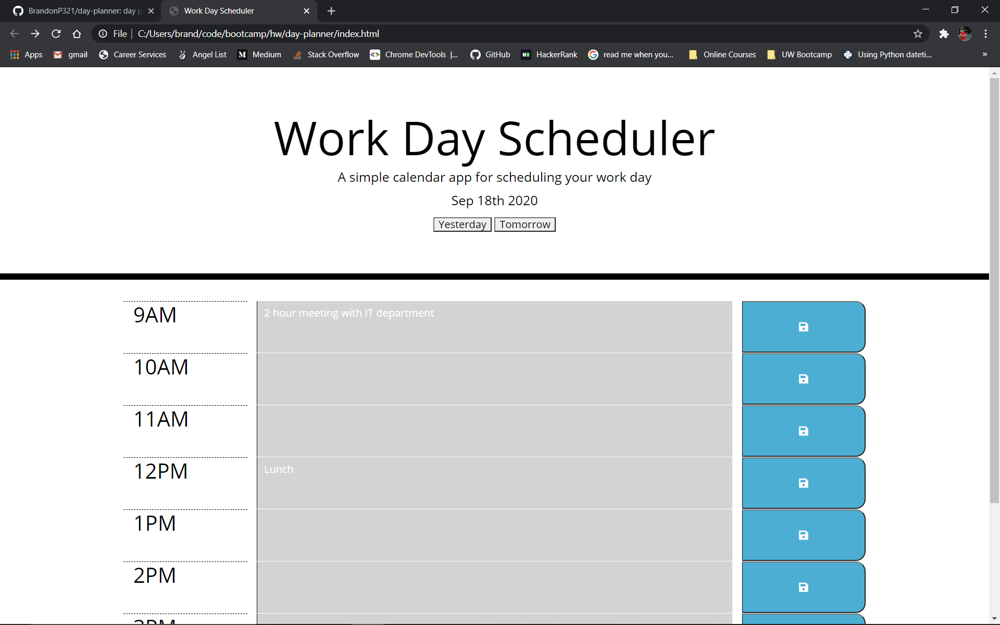

# Day Planner Site
This is a rather simple website designed to allow a user to input events, reminders etc. for any given hour from 9AM to 5PM for any day of the year.  For each hour displayed on the site, the hour will either have a gray, red, or green background color to represent whether that hour is in the past, present, or future respectively.  The user can click either a 'tomorrow' or 'yesterday' button to move to a different date to store info on.

## Screenshots

## Local Storage
In order to store info for each hour of any given day of the year, we needed to store the user's input in an object with info for each hour of the day.  That object was then paired to a key in local storage equal to that day's date.  This allowed the app to be more scalable rather than only allowing the user to enter details in for on single day.

## Website
https://brandonp321.github.io/day-planner/